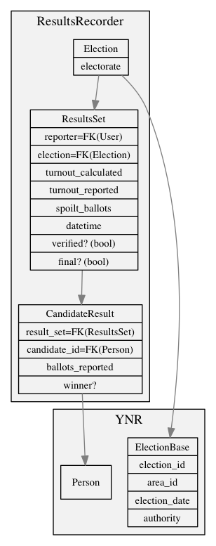

# WhoCanIVoteFor

This project is brand new!

It is designed for people who don't know loads about the ins and outs of elections to use to find out everything about upcoming elections, including candidates, polling stations, electon dates, etc.

It will have the following features:

* "Given a postcode, when is my next election?"
* "Who are the candidates per election?"
* "Where is my polling staion?"
* Enter email address and postcode to get alerted about future elections in yous area
* Option to show interest in standing for future elections
* Option to donate to DC in order to keep the site running
* Option to record results of elections (power users only, maybe in a different interface to the normal one)
* …and other things like that.

It might be good to look at [this issue](https://github.com/mysociety/yournextrepresentative/issues/584) for a little more info.

The reason for building this site:

1. We have some other tools that are designed for gathering data, for example [Democracy Club Candidates](https://candidates.democracyclub.org.uk/) and [UK Polling Statons](http://pollingstations.democracyclub.org.uk/).  There is value in keeping these sites on their own, as the candidates one in particular has a very different audiance to this site.
2. We want to allow 3rd parties to write sites that we can include in this one via data dumps.  3rd parties shouldn't have to use our codebase in order to make interesting things.  We saw this a low during the UK General Election.
3. This site is very read heavy, so we can think about optimizing for that, rather than both read and write heavy operations.  In 2015 this site was [a Jekyll install](https://github.com/DemocracyClub/YourNextMP-Read).
4. We want to be able to spin up new ideas quickly in this codebase, and not pollute the [YourNextRepresentative](https://github.com/DemocracyClub/YourNextRepresentative) code too much (it has an international focus)

## Results Recorder App

This app will be used by people both at counts and after the count to record results from each election.

Initially this is fairly simple: there is an Election model (that we might borrow from [YourNextRepresentative](https://github.com/DemocracyClub/YourNextRepresentative) (YNR), with a sub-class for storing the size of the electorate), a ResultsSet and a CandidateResult model:

An authenticated user can navigate to an election and area.  There they see a form with each candidate known about and a text input to enter the number of notes cast for that person.

In addition to this, we will ask them to record the number of spoilt votes, and the turn out if it's reported.

The slight complication is that we might want to record more than one result per election.  There are a number of reasons for this:

1. The result may have been recorded incorrectly, either because of a mistake or out of malice.
2. The result announced at the count might not be the actual final result – apparently this happens alarmingly often.
3. More than one person might report the results.
4. Someone might want to double check the results as published on the council's web site at a later date (see #2).

Because of this, we can have more than one `ResultsSet` per election.

There should be a nice way to see `ResultsSet` objects that have differing results recorded, and we should provide some shortcuts, for example to `ResultsSet` objects where the sum of the `CandidateResult` `votes_cast` field isn't the same.

The other complication comes with different voting systems – for example [Single Transferable Vote](https://en.m.wikipedia.org/wiki/Single_transferable_vote), as used in Northern Ireland.  This could be out of scope for this initial phase of work – more research time is needed to see how complex this will be to model.
